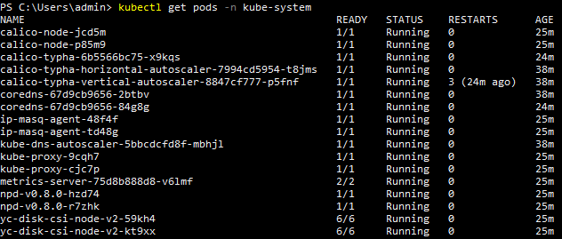
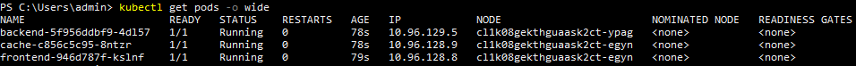
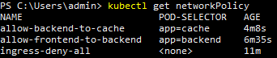
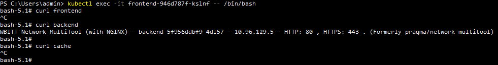
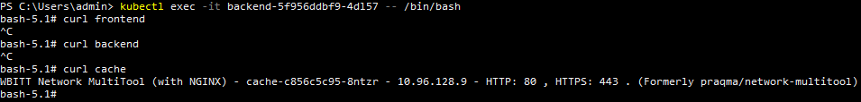
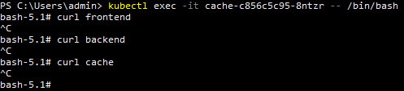

# Домашнее задание к занятию «Как работает сеть в K8s»

1. Создан кластер с сетевым плагином Calico:  
     
   Из [manifest файла](./files/deployment.yaml) в default namespace развёрнуты деплойменты для frontend, backend, и cache:  
     
   На default namespace применен [manifest файл](./files/network-policy.yaml) сетевых политик запрещающий весь трафик кроме трафика от frontend к backend и от backend к cache:  
     
   C fronend команда curl отрабатывает только до backend:  
     
   С backend команда curl отрабатывает только до cache:  
     
   С cache команда curl не отрабатывает ни на один адрес:  
     